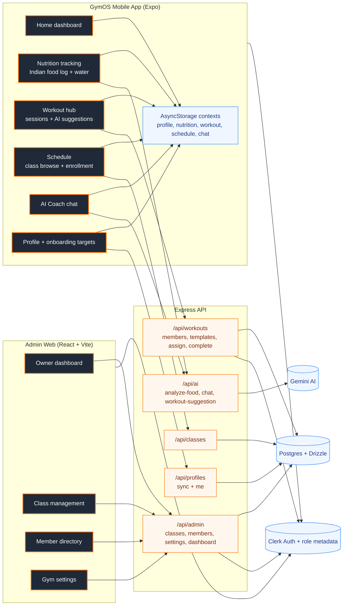
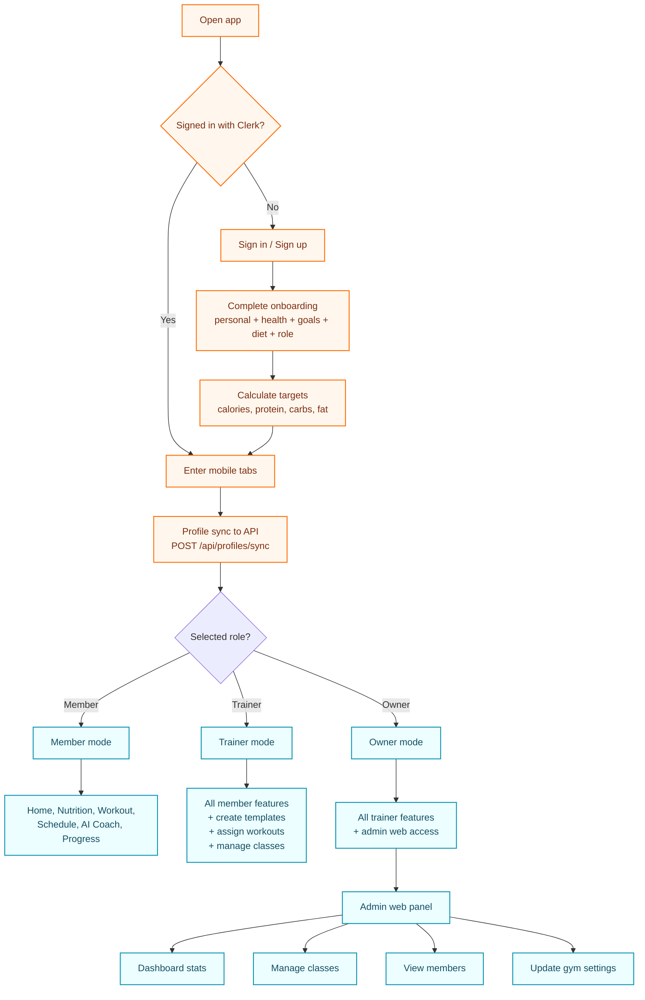
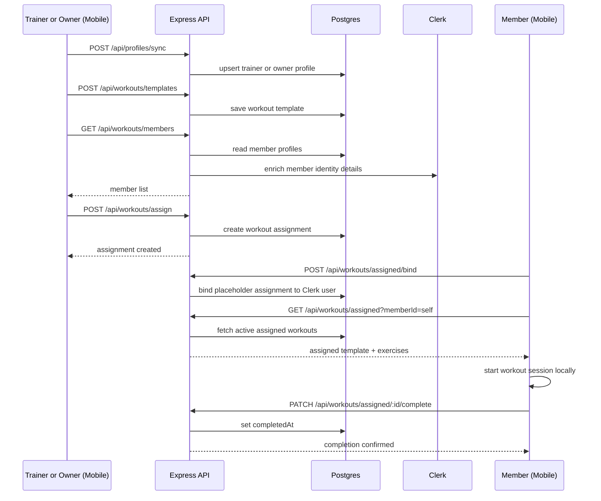
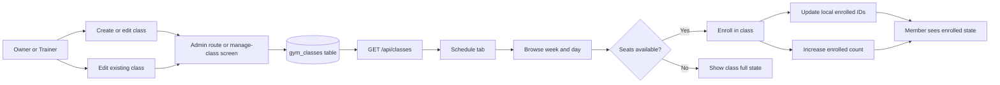
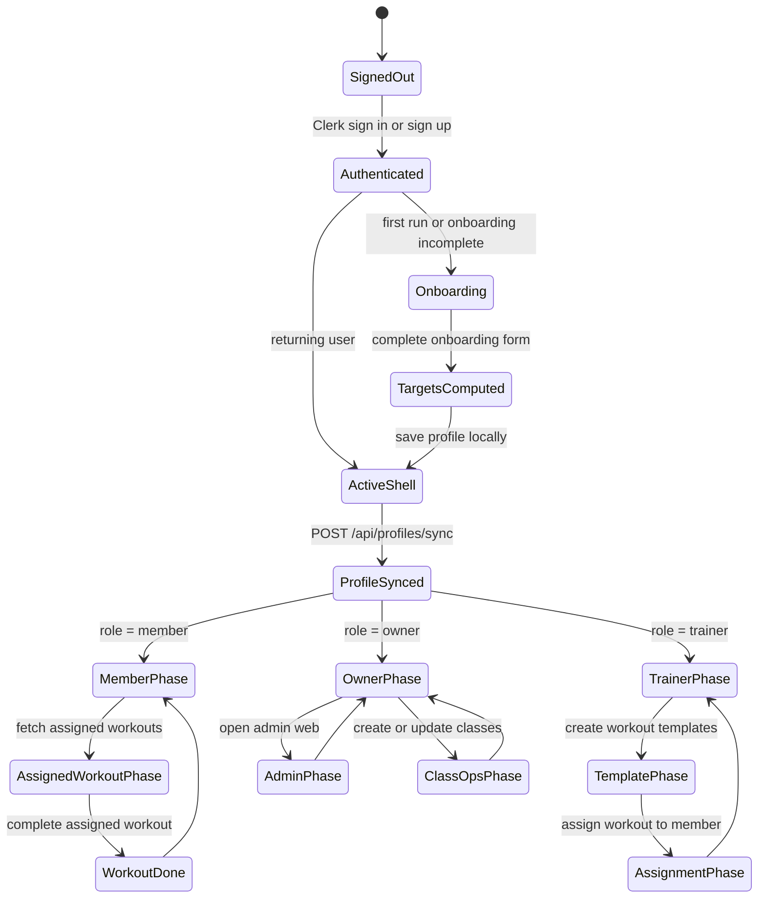

# Fitness Hub AI Diagrams

These diagrams reflect the current code in:

- `artifacts/gymapp`
- `artifacts/admin`
- `artifacts/api-server`
- `lib/db/src/schema`

They focus on three things:

- what the app does
- how users and staff move through it
- what phases the app moves through during real use

## 1. System Functionality Map

What this shows:

- the mobile app is the daily operating surface for members, trainers, and owners
- the admin web app is owner-only and focuses on management workflows
- the API is the bridge between UI, database, Clerk, and Gemini
- some member experience is local-first through AsyncStorage, while management flows are server-backed

## 2. Role-Based App Flow

What this shows:

- everyone starts with Clerk auth and onboarding
- onboarding is where the role is chosen
- role decides whether the user only consumes plans, also manages workouts/classes, or additionally gets owner web admin

## 3. Trainer-to-Member Workout Flow

What this shows:

- trainer and owner users act as program creators
- members act as program consumers and completers
- assignments are stored server-side so completion can be tracked

## 4. Class Scheduling and Enrollment Flow

What this shows:

- classes are authored by staff and published from the database
- members discover classes through the schedule tab
- enrollment is part public-feed driven and part local state driven in the mobile app

## 5. App Phases

Interpretation:

- phase 1 is access
- phase 2 is onboarding and target generation
- phase 3 is role activation through profile sync
- phase 4 becomes role-specific usage
- phase 5 is outcome tracking, such as assigned workout completion or owner operations

## Quick Read

- `member` is the main daily fitness user
- `trainer` adds programming and assignment power
- `owner` gets the full operational layer, including the admin web panel
- AI is used in three places: food analysis, chat coaching, and workout suggestion
- the app mixes local-first fitness tracking with server-backed gym operations
